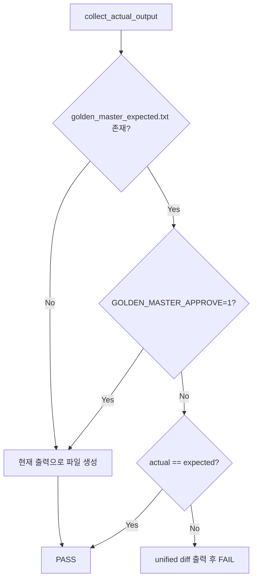

# Golden Master (Approval) 패턴 설계 — Magic Square Solver

## 1. 목적

Magic Square Solver의 **관측 가능한 출력**을 기준 파일(Golden Master)과 비교해 회귀를 탐지한다.  
출력 캡처는 CLI stdout이 아닌 **`MagicSquareControl.solve()` 반환 DTO** 직렬화를 사용한다.

| 성공 | `list[int]` (길이 6, 1-index 좌표) |
| 실패 | `FailureResult` (`code`, `message`) — Golden Master에는 `code`만 기록 |

## 2. 시나리오 (GM-1)

| 섹션 | 의도 | 입력 요약 | 현재 기대 출력 |
|------|------|-----------|----------------|
| `[normal_success]` | Step A 정상 조합 | 사용자 예시 4×4 격자 | `Output: [3,3,1,4,4,6]` |
| `[reverse_success]` | Step B(reverse) 성공 격자 (G2) | G0에서 (0,0),(0,1) 빈칸 | `Output: [1,1,3,1,2,16]` ※Track B 전 Step A |
| `[invalid_blank_count]` | 빈칸 개수 ≠ 2 | 3개 빈칸 격자 | `Error: E002` |
| `[duplicate_number]` | non-zero 중복 | 8 중복 격자 | `Error: E005` |
| `[no_valid_solution]` | 양쪽 조합 실패 (G3) | 산술 확정 G3 격자 | `Output: [1,1,13,1,4,16]` ※Track B 전 Step A |

> **Track B 후속:** `reverse_success`·`no_valid_solution`은 Domain GREEN 후 `GOLDEN_MASTER_APPROVE=1`로 기준 파일을 재승인해야 한다.

## 3. 기준 파일 구조

파일: `tests/golden_master_expected.txt`

```
[normal_success]
Input:
16 2 3 13
5 11 10 8
9 7 0 12
4 14 15 0
Output:
[3,3,1,4,4,6]
________________________________________

[reverse_success]
...
```

- 섹션 구분: `________________________________________`
- `Input:` — 공백 구분 4행
- 성공: `Output:` + `[r,c,v,r,c,v]` (쉼표, 공백 없음)
- 실패: `Error:` + 오류 코드 한 줄 (`E002`, `E005` 등)

## 4. Approve 패턴



### 4.1 동작 규칙

| 조건 | 동작 |
|------|------|
| 기준 파일 없음 | `actual`을 파일에 쓰고 **PASS** (최초 승인) |
| 기준 파일 있음 | `actual` vs `expected` 문자열 전체 비교 |
| 불일치 | `difflib.unified_diff` 출력 후 `AssertionError` |
| 강제 승인 | 환경 변수 `GOLDEN_MASTER_APPROVE=1` (또는 `true`/`yes`) |

### 4.2 모듈 구성

| 경로 | 역할 |
|------|------|
| `tests/golden_master/scenarios.py` | 5개 시나리오 입력 SSOT |
| `tests/golden_master/serializer.py` | DTO → 텍스트 직렬화·파싱 |
| `tests/golden_master/approval.py` | approve 패턴 (`approve`, `run_golden_master_approval`) |
| `tests/test_golden_master_magic_square.py` | GM-2 pytest (`GM-TC-00`~`05`, `@pytest.mark.golden_master`) |
| `tests/golden_master/contracts.py` | int[6], row-major, 1-index, small-first, Error Contract 검증 |
| `scripts/generate_golden_master.py` | 기준 파일 재생성 CLI |

## 5. 사용 방법

### GM-2 테스트 실행

```powershell
.venv\Scripts\python.exe -m pytest -m golden_master -v
```

또는 파일 지정:

```powershell
.venv\Scripts\python.exe -m pytest tests/test_golden_master_magic_square.py -m golden_master -v
```

### GM-2 테스트 케이스

| Test ID | 섹션 | 검증 |
|---------|------|------|
| `test_gm_tc_01_normal_success` | `normal_success` | int[6], 1-index, row-major, small-first + baseline |
| `test_gm_tc_02_reverse_success` | `reverse_success` | 좌표 계약 + baseline (Track B 후 reverse 재승인) |
| `test_gm_tc_03_invalid_blank_count` | `invalid_blank_count` | E002 Error Contract + baseline |
| `test_gm_tc_04_duplicate_number` | `duplicate_number` | E005 Error Contract + baseline |
| `test_gm_tc_05_no_valid_magic_square` | `no_valid_solution` | int[6] 계약 + baseline |

모든 GM-TC 테스트에 `@pytest.mark.golden_master` 적용.

### 기준 파일 최초·재생성

```powershell
cd c:\DEV\MagicSquare_05
.venv\Scripts\python.exe scripts\generate_golden_master.py
```

또는 테스트 실행 시 approve:

```powershell
$env:GOLDEN_MASTER_APPROVE = "1"
.venv\Scripts\python.exe -m pytest tests/test_golden_master.py -q
```

### 회귀 검증

```powershell
.venv\Scripts\python.exe -m pytest tests/test_golden_master.py -q
```

### 버전 관리

```powershell
git add tests/golden_master_expected.txt
```

기준 파일은 **반드시** 저장소에 포함한다. 의도된 출력 변경 시에만 approve로 갱신한다.

## 6. ECB·TDD 정합

- **테스트 경로:** `MagicSquareControl.solve()` — GUI와 동일한 Control 진입점
- **레이어:** 테스트는 `tests/`에 위치; `src/` 프로덕션 코드 변경 없음
- **TDD:** GM-1 테스트는 현재 Track A GREEN 출력을 기준으로 **GREEN**; Track B 구현 후 RED → approve → GREEN 사이클 예상

## 7. PRD 오류 코드 매핑 (참고)

| Golden Master `Error:` | PRD 코드 | 메시지 |
|------------------------|----------|--------|
| `E002` | `ERR_INVALID_BLANK_COUNT` | Blank count must be exactly 2. |
| `E005` | `ERR_DUPLICATE_VALUE` (PRD 명칭) | Non-zero values must be unique. |
| (Track B) | `ERR_NO_VALID_COMBINATION` | Both solve attempts failed… |

현재 Boundary 구현은 `E002`/`E005` 리터럴을 사용하므로 Golden Master는 **실제 DTO `code`** 를 기록한다.
