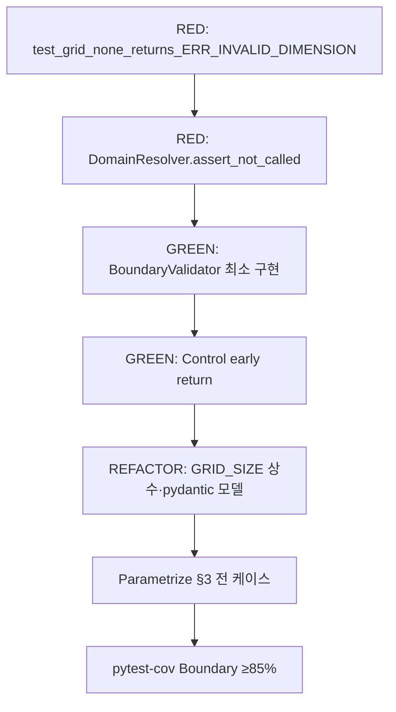

# MagicSquare — 테스트 계획서 (Test Plan)

| 항목 | 내용 |
|------|------|
| **문서 버전** | 1.0 |
| **작성 기준** | `docs/PRD_MagicSquare.md`, 샘플 예제 AC-FR01-01 |
| **대상 AC** | AC-FR01-01 (4×4 아님 → `ERR_INVALID_DIMENSION`), AC-FR01-05 (Domain resolver 미호출) |
| **기술 스택** | Python 3.11+, pytest, pydantic, unittest.mock |
| **Track** | Track A — Boundary / UI Contract TDD |
| **대상 컴포넌트** | `BoundaryValidator` (FR-01), 호출 조율 `Control` (FR-01→FR-05 게이트) |

### 샘플 앵커 시나리오

| 항목 | 값 |
|------|-----|
| **AC ID** | AC-FR01-01 (+ 보조 AC-FR01-05) |
| **BR** | BR-01 (입력 행렬은 정확히 4행 4열) |
| **FR** | FR-01 Input Verification (PRD §10) |
| **대표 입력** | `grid = None` |
| **기대 출력** | `{ "code": "ERR_INVALID_DIMENSION", "message": "Input matrix must be 4x4." }` |
| **테스트 후보 ID** | TC-BND-001 (RED-BND-VAL-001) |

> **명명 참고:** 일부 작업 문서·예제에서는 `INVALID_SIZE`로 표기할 수 있으나, PRD·계약(§12, §13)의 정식 오류 코드는 **`ERR_INVALID_DIMENSION`** 이다. 본 계획서의 assert 기준은 PRD 정식 코드를 따른다.

---

## 1. 목적 및 범위

### 1.1 목적

- FR-01의 **가장 선행** Acceptance Criteria인 입력 크기 검증(AC-FR01-01)을 pytest 단위 테스트로 고정한다.
- Boundary에서 차단 시 **Domain 해 결정 진입점이 호출되지 않음**(AC-FR01-05)을 mock/spy로 검증한다.
- Dual-Track TDD의 Track A(RED-BND-VAL-001)를 RED → GREEN → REFACTOR 루프의 출발점으로 사용한다.

### 1.2 In-Scope (본 계획서)

| 범위 | 포함 |
|------|------|
| 레이어 | `src/boundary/` — `BoundaryValidator` 크기 검증 |
| 조율 | `src/control/` — 검증 실패 시 Domain 진입 차단 |
| 테스트 유형 | 단위 테스트 (pytest), AAA 패턴 |
| AC | AC-FR01-01, AC-FR01-05 |
| TC | TC-BND-001 계열 (차원 오류) |

### 1.3 Out-of-Scope (본 계획서 — 명시적 제외)

| 제외 항목 | 사유 |
|-----------|------|
| **4×4 정상 입력** | AC-FR01-01 “크기 불일치” 범위 외; FR-02~05·Track B로 분리 |
| FR-01-02~04 (빈칸 개수, 범위, 중복) | 별도 TC-BND-002~004 계획 (후속 스프린트) |
| FR-04 마방진 불변식 | Domain Track B |
| FR-05 Solver/출력 포맷 | TC-DOM-SOL / TC-BND-OUT |
| UI/DB/Web/API | PRD Out-of-Scope |

---

## 2. pytest 기반 단위 테스트 — 범위 및 우선순위

### 2.1 테스트 파일·모듈 매핑 (예정)

| 우선순위 | 테스트 모듈 (예정) | 대상 SUT | AC / TC |
|----------|-------------------|----------|---------|
| **P0** | `tests/boundary/test_boundary_validator_dimension.py` | `BoundaryValidator.validate(grid)` | AC-FR01-01, TC-BND-001 |
| **P0** | `tests/control/test_solve_orchestration_dimension.py` | `Control.solve(grid)` (가칭) | AC-FR01-05, Domain 미호출 |
| **P1** | `tests/boundary/test_error_response_contract.py` | pydantic `ErrorResponse` 모델 | §12 계약, 예외 throw 금지 |
| **P2** | `tests/boundary/test_boundary_validator_parametrize.py` | 동일 SUT, 파라미터 확장 | TC-BND-001 변형 일괄 |

### 2.2 우선순위 정의

| 등급 | 기준 | 실행 시점 |
|------|------|-----------|
| **P0** | AC-FR01-01/05 직접 매핑, RED 최초 실패 유도, 회귀 필수 | 매 커밋, pre-push |
| **P1** | 응답 스키마·결정론(NFR-02)·입력 불변(NFR-03) | P0 GREEN 후 |
| **P2** | 파라미터화·문서화·리팩터 안전망 | REFACTOR 단계 |

### 2.3 단위 테스트 설계 원칙

- **AAA** (Arrange → Act → Assert) — 각 `test_*` 함수 1 시나리오 1 assert 그룹.
- **격리:** Boundary 테스트는 Domain/Entity 구현체를 import하지 않는다 (ECB: `boundary` → `entity` 직접 의존 금지).
- **결정론:** 동일 `grid` 입력 → 동일 `code` / `message` (NFR-02).
- **실패 정책:** `pytest.raises`로 예외 기대 금지 — 표준 오류 응답 객체 반환만 검증 (§13).
- **pydantic:** `ErrorResponse`로 `code`, `message` 필드 고정; 스키마 위반 시 테스트 RED.

### 2.4 P0 테스트 케이스 요약 (TC-BND-001)

| Test ID | 설명 | 입력 | 기대 `code` | Domain 호출 |
|---------|------|------|-------------|---------------|
| RED-BND-VAL-001a | 명시적 None | `None` | `ERR_INVALID_DIMENSION` | 0 |
| RED-BND-VAL-001b | 빈 리스트 | `[]` | `ERR_INVALID_DIMENSION` | 0 |
| RED-BND-VAL-001c | 행만 4, 열 0 | `[[]] * 4` | `ERR_INVALID_DIMENSION` | 0 |
| RED-BND-VAL-001d | 3×4 | `3×4` 행렬 fixture | `ERR_INVALID_DIMENSION` | 0 |
| RED-BND-VAL-001e | 4×3 | `4×3` 행렬 fixture | `ERR_INVALID_DIMENSION` | 0 |
| RED-BND-VAL-001f | 5×5 | `5×5` 행렬 fixture | `ERR_INVALID_DIMENSION` | 0 |

---

## 3. 경계값 케이스 목록 (AC-FR01-01)

본 절의 모든 케이스는 **동일 기대 출력**을 가진다.

```json
{
  "code": "ERR_INVALID_DIMENSION",
  "message": "Input matrix must be 4x4."
}
```

### 3.1 포함 케이스

| # | 케이스 ID | 입력 `grid` | 검증 포인트 | 비고 |
|---|-----------|-------------|-------------|------|
| 1 | `DIM-NULL` | `None` | 타입/존재성 선행 검사 | 샘플 앵커; `is None` 분기 명시 |
| 2 | `DIM-EMPTY` | `[]` | 행 수 = 0 | 최소 빈 입력 |
| 3 | `DIM-ROW-ONLY` | `[[]] * 4` | 행=4, 열=0 | `len(row) != 4` 실패; mutable row 함정 회귀용 |
| 4 | `DIM-3X4` | 3행×4열 정수 리스트 | `len(grid) != 4` | 행 수 불일치 |
| 5 | `DIM-4X3` | 4행×3열 정수 리스트 | `len(grid[i]) != 4` | 열 수 불일치 |
| 6 | `DIM-5X5` | 5행×5열 정수 리스트 | 양방향 초과 | 정방형이나 크기 ≠ 4 |

### 3.2 Fixture 예시 (Arrange — 문서용; 구현 시 tests/conftest.py)

```python
# 3×4 — 행 3, 열 4
GRID_3X4 = [[1] * 4 for _ in range(3)]

# 4×3 — 행 4, 열 3
GRID_4X3 = [[1] * 3 for _ in range(4)]

# 5×5
GRID_5X5 = [[1] * 5 for _ in range(5)]
```

### 3.3 명시적 제외 (본 AC 범위 외)

| 제외 케이스 | 제외 사유 |
|-------------|-----------|
| **4×4 정상 입력** (빈칸 2개, 값 0\|1..16, 중복 없음) | AC-FR01-01 통과 경로; TC-BND-002 이후·Track B로 이동 |
| 4×4이나 빈칸 개수 ≠ 2 | AC-FR01-02 (`ERR_INVALID_BLANK_COUNT`) |
| 4×4이나 값 범위 위반 | AC-FR01-03 |
| 4×4이나 0 제외 중복 | AC-FR01-04 |

---

## 4. 예외 / 특이 케이스 목록

| # | 케이스 ID | 입력 / 조건 | 기대 동작 | AC / 정책 |
|---|-----------|-------------|-----------|-----------|
| E1 | `DIM-NON-SEQUENCE` | `grid = 123` (int) | `ERR_INVALID_DIMENSION`, 예외 미발생 | AC-FR01-01, §13 |
| E2 | `DIM-RAGGED` | `[[1,2,3,4], [1,2], [1,2,3,4], [1,2,3,4]]` | 열 길이 불일치 → 차원 오류 | BR-01 |
| E3 | `DIM-NESTED-NON-INT` | `[[1, "x", 3, 4], ...]` (4×4 형태) | **본 계획서 제외** — 값 검증은 AC-FR01-03; 크기 검증 통과 후 별도 TC | FR-01-03 |
| E4 | `DIM-MUTABLE-ROW-TRAP` | `[[]] * 4` 후 한 행만 `[1,2,3,4]` 변경 | 여전히 차원 오류 또는 ragged; **입력 불변(NFR-03)** — validator가 입력을 mutate하지 않음 | NFR-03 |
| E5 | `DIM-TUPLE-GRID` | `tuple` of 4 `tuple`s (4×4) | 프로젝트 결정 필요: 허용 시 통과 경로, 불허 시 `ERR_INVALID_DIMENSION` | Open — pydantic 입력 타입 |
| E6 | `DIM-CONTROL-SHORT-CIRCUIT` | Control에 invalid `grid` 전달 | `BoundaryValidator` 1회 호출 후 resolver **0회** | AC-FR01-05 |
| E7 | `DIM-NO-EXCEPTION-POLICY` | 모든 §3 케이스 | `Exception` 미전파; ErrorResponse만 반환 | §13 |

---

## 5. Domain 해 결정 진입점 — 호출 횟수 검증 전략 (mock / spy)

### 5.1 “Domain 해 결정 진입점” 정의 (PRD §17–18)

| 진입점 (가칭) | 레이어 | FR | 호출 조건 |
|---------------|--------|-----|-----------|
| `DomainResolver.solve` (가칭) | Control → Entity 조율 | FR-02~05 게이트 | Boundary 검증 **성공** 후만 |
| `BlankFinder.find` | Entity | FR-02 | 검증 통과 후 |
| `MissingNumberFinder.find` | Entity | FR-03 | 검증 통과 후 |
| `MagicSquareValidator.validate` | Entity | FR-04 | 검증 통과 후 |
| `Solver.solve` | Entity | FR-05 | 검증 통과 후 |

AC-FR01-01 실패 시나리오에서는 위 **전부 0회** 호출이어야 한다 (AC-FR01-05).

### 5.2 권장 mock 대상 (단일 스파이 지점)

**1차 (P0):** Control 레이어의 `DomainResolver` (또는 `resolve_magic_square`) — Boundary 통합 경로 1곳만 patch.

```python
# tests/control/test_solve_orchestration_dimension.py (개념 예시)
from unittest.mock import MagicMock, patch

@patch("src.control.magic_square_control.DomainResolver")
def test_grid_none_does_not_invoke_domain_resolver(mock_resolver_cls):
    mock_resolver_cls.return_value.solve = MagicMock()
    result = control.solve(grid=None)

    assert result.code == "ERR_INVALID_DIMENSION"
    mock_resolver_cls.return_value.solve.assert_not_called()
```

**2차 (P1):** Entity 개별 컴포넌트 spy — 리팩터 후 회귀 방지.

```python
with (
    patch("src.entity.blank_finder.BlankFinder.find") as mock_blank,
    patch("src.entity.solver.Solver.solve") as mock_solver,
):
    control.solve(grid=[])
    mock_blank.assert_not_called()
    mock_solver.assert_not_called()
```

### 5.3 검증 매트릭스 (AC-FR01-01 케이스 공통)

| Assert | 방법 | 기대 |
|--------|------|------|
| Resolver 호출 횟수 | `assert_not_called()` / `call_count == 0` | 0 |
| BoundaryValidator 호출 | spy (선택) | 1회 (Control 경로) |
| 부작용 | 입력 `grid` id/내용 스냅샷 | 변경 없음 (NFR-03) |
| 반환 타입 | `isinstance(result, ErrorResponse)` | pydantic 검증 통과 |

### 5.4 Anti-patterns (금지)

- Domain 로직을 Boundary 테스트에서 **실구현 호출**하여 간접 검증 (책임 혼합).
- 검증 실패 시나리오에서 `pytest.raises(Exception)` 사용 (§13 위반).
- mock 없이 “결과만 null”로 Domain 미호출 추정 (AC-FR01-05 미충족).

---

## 6. 커버리지 목표

| 레이어 | PRD 목표 (NFR-01) | 본 AC-FR01-01 스프린트 최소 | 측정 대상 |
|--------|-------------------|---------------------------|-----------|
| **Domain (entity)** | **≥ 95%** | 해당 없음 (진입 차단만 검증) | `src/entity/` — Track B 별도 |
| **Boundary** | **≥ 85%** | **≥ 85%** (`BoundaryValidator` 차원 분기) | `src/boundary/` |
| **Control** | PRD 명시 없음 | orchestration 분기 100% (invalid path) | `src/control/` |
| **프로젝트 최소 (rules)** | 80%+ | 80%+ 유지 | 전체 `src/` |

### 6.1 AC-FR01-01 스프린트에서 반드시 커버할 분기

- `grid is None`
- `not grid` / `len(grid) != GRID_SIZE`
- `any(len(row) != GRID_SIZE for row in grid)`
- 오류 응답 생성 경로 (early return)
- Control의 “검증 실패 → return error” 분기

---

## 7. pytest-cov 측정 전략

### 7.1 설치

```bash
pip install pytest-cov
```

(프로젝트 의존성 고정 시 `requirements-dev.txt` 또는 `pyproject.toml`에 `pytest-cov` 추가 권장)

### 7.2 기본 측정 (전체)

```bash
pytest --cov=src --cov-report=term-missing
```

### 7.3 레이어별 게이트 (권장)

**Boundary — AC-FR01-01 스프린트 (FAIL UNDER 85):**

```bash
pytest tests/boundary/test_boundary_validator_dimension.py ^
  --cov=src/boundary ^
  --cov-report=term-missing ^
  --cov-fail-under=85
```

**Domain — Track B (별도 실행, FAIL UNDER 95):**

```bash
pytest tests/entity/ ^
  --cov=src/entity ^
  --cov-report=term-missing ^
  --cov-fail-under=95
```

**Control — orchestration (AC-FR01-05):**

```bash
pytest tests/control/test_solve_orchestration_dimension.py ^
  --cov=src/control ^
  --cov-report=term-missing
```

### 7.4 HTML / CI 리포트 (선택)

```bash
pytest --cov=src --cov-report=html --cov-report=term-missing
# 산출: htmlcov/index.html
```

### 7.5 해석 규칙

| 규칙 | 설명 |
|------|------|
| **미구현 RED** | `src/boundary` 미존재 시 커버리지 0% — GREEN 전까지 게이트 실패 허용 |
| **term-missing** | AC-FR01-01 분기 미커버 라인을 RED→GREEN 시 우선 제거 |
| **과도한 전체 cov** | Domain 미호출 테스트만으로 entity 95% 달성 불가 — 레이어 분리 측정 필수 |
| **약화 금지** | `# pragma: no cover` 남용·테스트 삭제로 통과 금지 (PRD §15.3, §20) |

---

## 8. 실행 순서 (Dual-Track TDD)



| 단계 | 액션 | 통과 기준 |
|------|------|-----------|
| RED-1 | `grid=None` 단위 테스트 추가 | 실패 (구현 없음) |
| RED-2 | mock으로 resolver 0회 assert | 실패 |
| GREEN-1 | `BoundaryValidator` 차원 검사 | §3 케이스 전부 PASS |
| GREEN-2 | Control short-circuit | AC-FR01-05 PASS |
| REFACTOR | 중복 제거, `GRID_SIZE=4` | 기존 테스트 유지 PASS |
| VERIFY | `pytest --cov=src/boundary --cov-fail-under=85` | 게이트 PASS |

---

## 9. 추적성 (Traceability)

| Concept | BR | FR | AC | Test ID | Component |
|---------|----|----|-----|---------|-----------|
| 4×4 입력 | BR-01 | FR-01 | AC-FR01-01 | TC-BND-001, RED-BND-VAL-001a~f | BoundaryValidator |
| Domain 미호출 | — | FR-01 | AC-FR01-05 | Control orchestration tests | Control + DomainResolver |
| 표준 오류 응답 | — | FR-01 §13 | AC-FR01-01 | ErrorResponse contract | BoundaryValidator |

---

## 10. 승인 및 변경 이력

| 버전 | 날짜 | 변경 내용 | 작성 |
|------|------|-----------|------|
| 1.0 | 2026-05-29 | AC-FR01-01 샘플 기반 초안 — 경계값·mock·cov 전략 | QA Lead (계획) |

---

## 부록 A — pytest 실행 치트시트

```bash
# P0만 빠르게
pytest tests/boundary/test_boundary_validator_dimension.py tests/control/ -q

# AC-FR01-01 전 경계값 (구현 후 parametrize)
pytest tests/boundary/test_boundary_validator_dimension.py -v

# 커버리지 + 누락 라인
pytest --cov=src --cov-report=term-missing
```

## 부록 B — 4×4 정상 입력 (참고용, 본 계획서 테스트에 미포함)

Track B / FR-02 선행 통과용 대표 행렬은 **별도 test plan (FR-02~)** 에서만 다룬다. AC-FR01-01 dimension 스위트에 **포함하지 않는다.**
